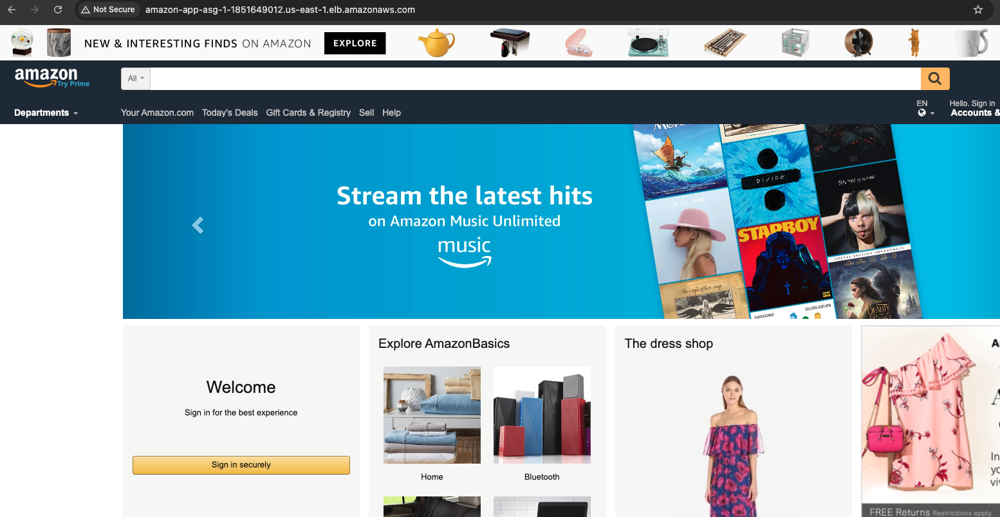
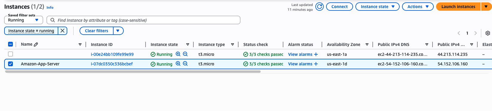
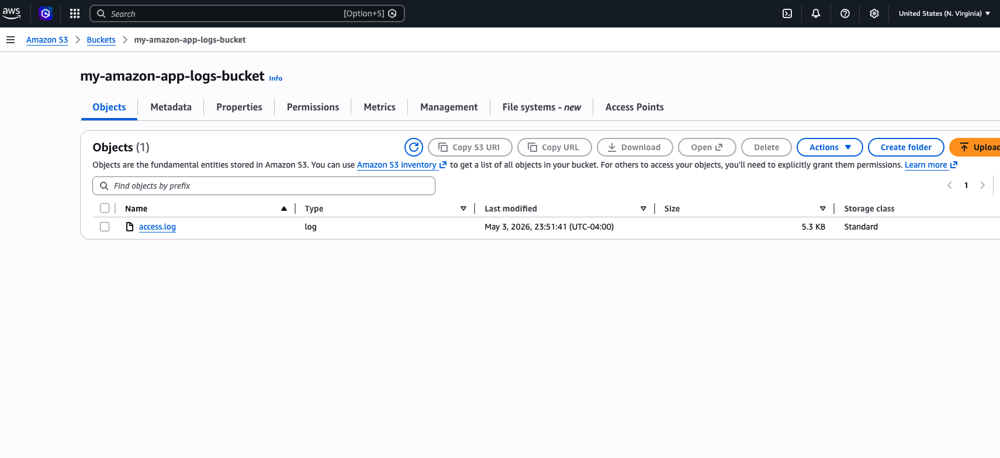

📝 GitHub Project Description (Short)
Scalable Cloud Infrastructure Deployment: A high-availability AWS architecture featuring an Auto Scaling Group, Application Load Balancer, and automated log management. Demonstrates proficiency in custom AMI creation, fault-tolerant design, and S3 data integration.

AWS Scalable Web Infrastructure: Amazon Clone Deployment
🎯 Project Objective
The goal of this project was to transition a manual application deployment into a scalable, fault-tolerant infrastructure. By moving from a single EC2 instance to an Auto Scaling Group (ASG) behind an Application Load Balancer (ALB), I ensured the application can handle traffic spikes and hardware failures automatically.

🛠 Tech Stack
Cloud: AWS (EC2, ASG, ALB, S3, IAM, AMI)

Web Server: Nginx

OS: Ubuntu 22.04 LTS

Scripting: Bash (User Data)

🏗 Key Engineering Tasks
1. Provisioning & Bootstrapping
Deployed a baseline Ubuntu instance and used a Bash script to automate the installation of Nginx and the application source code.

Skill: Infrastructure Automation.

2. Custom Image (AMI) Engineering
Created a "Golden Image" from the configured server.

Benefit: This reduces "boot time" (Time-to-Service) during scaling events because the application is already pre-installed in the image.

3. High Availability & Load Balancing
Configured an Application Load Balancer (ALB) to act as a single point of entry.

Implemented an Auto Scaling Group across multiple Availability Zones.

Policy: The infrastructure automatically scales from 2 to 4 instances based on CPU utilization, ensuring cost-efficiency during low traffic and performance during peaks.

4. Observability & Data Persistence
Implemented an IAM Role using the principle of least privilege to allow EC2-to-S3 communication.

Established a manual log-shipping workflow for nginx/access.log to Amazon S3 for long-term retention and audit trails.

## 📸 Deployment Verification

### 1. Application Accessibility
The Amazon clone is successfully served via the Application Load Balancer DNS.

### 2. High Availability & Scaling
The Auto Scaling Group (ASG) maintains a minimum of two running instances across different Availability Zones.

### 3. Log Management
Nginx access logs successfully transferred to the S3 bucket via the AWS CLI and IAM Role.
